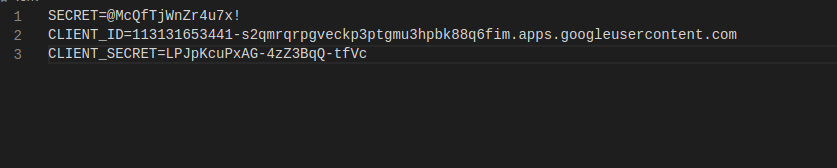

# Secret App

This is an app project created to practice authentication and encryption with EJS, node.js and mongoose.

The functionality is simple, every user post a secret which will be displayed in the secrets page.

The following methods are applied:

- Register/Login locally
- Register/Login with google using OAuth

- Authentication with passport

- Cookies
- Environment Variables

