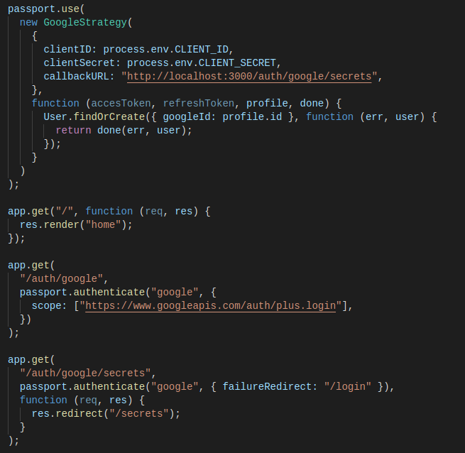

# PERSONAL BLOG NODE

This is an app project created to practice authentication and encryption with EJS, node.js and mongoose.

The functionality is simple, every registered user post a secret which will be displayed in the home page.

## Download

On the designated folder, clone the repository in the terminal with the following code:

```
$ git clone https://github.com/rgdotta/secrets-app-encryption.git
```

### Install

To install the dependencies, on the repository folder, type the following code on the terminal:

```
$ npm install
```

After that, start the local server with:

```
$ npm start
```

The aplication will start on: https://localhost:3000/

## Technologies:

- ES6+
- Node.js
- MongoDB with mongoose
- EJS
- Dotenv
- Passport
- Google OAuth

## Screenshots


The following methods are applied:

- Register/Login locally
- Register/Login with google using OAuth


- Authentication with passport



- Environment Variable with dotenv
